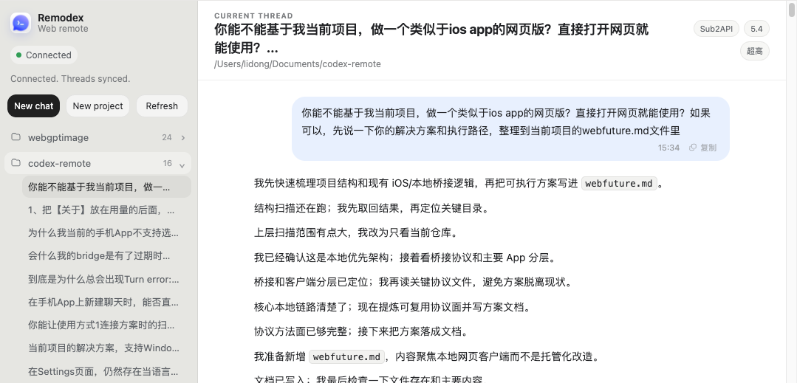

# Codex Remote


For a Simplified Chinese version of this guide, see [README.zh-CN.md](README.zh-CN.md).

Codex Remote is a local-first workspace for controlling Codex from iPhone while keeping execution, git operations, and repository access on your own Mac.

This repository focuses on local and self-hosted workflows. It does not assume a hosted production service or hardcoded public endpoint.

Follow the project creator on X: [@lidongyx](https://x.com/lidongyx).

> Note
> The repository name is `codex-remote`, while some app names, CLI commands, package names, bundle identifiers, and internal paths still use `remodex` or `phodex`. Those compatibility names remain in place during the ongoing rename.

## Overview

This repository currently contains:

- an iOS client in `CodexMobile/`
- a browser client in `web/`
- a local Node.js bridge in `phodex-bridge/`
- a self-hostable relay in `relay/`
- root maintenance scripts in `package.json`
- a local bootstrap script in `./run-local-remodex.sh`

The intended flow is simple:

1. Start the local relay and bridge on your Mac.
2. Build the iOS app from source.
3. Pair the iPhone with the Mac by scanning the QR code.
4. Use the phone as a remote Codex client while the Mac remains the execution host.

## Prerequisites

- macOS for the primary local workflow
- Node.js 18+
- [Codex CLI](https://github.com/openai/codex) installed and available in `PATH`
- Xcode 16+ if you want to build the iOS app from source
- an iPhone for on-device pairing and testing
- Docker and a Cloudflare-managed domain if you want remote Web access through Cloudflare Tunnel

## Quick Start: Method 1 Local Pairing

Method 1 is the current primary path. It runs a local relay plus the Node.js bridge on your Mac, then pairs the iPhone app to that Mac with the QR code printed by the bridge.

### 1. Clone And Install Node Dependencies

From the repository root:

Install Node dependencies for the bridge and relay:

```sh
npm run bootstrap:node
```

This installs dependencies in both `phodex-bridge/` and `relay/`.

### 2. Build And Install The iOS App

Build the iOS app from source:

```sh
cd CodexMobile
open CodexMobile.xcodeproj
```

In Xcode:

1. Select your signing team.
2. Select a real iPhone as the run destination.
3. Build and run the `CodexMobile` target on that device.

Keep the app installed on the phone before starting the bridge so you can scan the pairing QR immediately.

### 3. Start The Local Relay And Bridge

Start the local development stack from the repository root:

```sh
./run-local-remodex.sh
```

The script:

- starts the local relay on `0.0.0.0:9000`
- chooses a LAN-reachable hostname for the QR code
- starts the source bridge from `phodex-bridge/`
- prints the relay URL, QR code, and pairing code
- keeps the relay process in the foreground until you press `Ctrl+C`

If the iPhone cannot reach the auto-detected hostname, pass the Mac's LAN IP or `.local` hostname explicitly:

```sh
./run-local-remodex.sh --hostname 192.168.1.23
```

You can also use the root scripts directly:

```sh
npm run dev:relay
npm run dev:bridge
npm run dev:local
```

For bridge lifecycle commands, use the repo-local CLI wrapper instead of a globally installed `remodex` package:

```sh
npm run bridge:status
npm run bridge:up
```

### 4. Pair The iPhone

After `./run-local-remodex.sh` prints the QR code:

1. Keep that terminal open.
2. Make sure the iPhone and Mac are on the same LAN, or that the relay hostname is reachable from the iPhone.
3. Open the app on your iPhone.
4. Choose the Method 1 connection flow and scan the QR code shown in the terminal.
5. If scanning is inconvenient, enter the printed pairing code manually if the app prompts for it.
6. Confirm the app shows the Mac as connected.

Each new `bridge:up` or `run-local-remodex.sh` pairing session prints a fresh QR code. Treat older QR codes and pairing codes as expired.

### 5. Use Codex From The Phone

Once connected:

1. Create or open a thread in the iOS app.
2. Pick or create a local workspace when prompted.
3. Send a prompt from the phone.
4. Leave the Mac awake and the bridge running while work is in progress.
5. Verify responses, reasoning, and tool output stream back to the phone.

Codex execution, file access, shell commands, and git operations still happen locally on the Mac. The phone is the remote UI.

### 6. Use Remodex Web

Remodex Web is the browser version of connection method 1. It connects to the same local relay + bridge path as the iOS app, while keeping Codex execution on your Mac.

```sh
npm install --prefix web
npm run web:dev
```

Then open `http://127.0.0.1:5173/`. The Web UI auto-pairs through the local bridge bootstrap endpoint when available, or you can paste the QR pairing payload JSON manually.

For phone browsers, the project/channel list collapses into a slide-out left menu opened from the button next to the thread title.

The screenshot below shows the current Web version presentation:



For full Web usage, Docker, domain, and Cloudflare Tunnel setup, see [Docs/WEB.md](Docs/WEB.md). The remote Tunnel shape is still local-first: Cloudflare exposes your local Web UI, relay, and bridge bootstrap endpoint, but Codex runs on your own machine.

### Windows Note

- If your bridge host is Windows, use `npm run bridge:up` or `npm run bridge:run` instead of `./run-local-remodex.sh`.
- The Windows bridge path is currently foreground-only. The macOS launch agent and related service-management commands do not apply there.
- Pairing and relay routing can still work on Windows, but you must manage process persistence yourself.
- See [Docs/windows-bridge-notes.md](Docs/windows-bridge-notes.md) for the detailed Windows setup notes.

## Connection Methods In The App

The Settings screen exposes two connection methods:

- **Method 1** is the current shipping local bridge flow described above. Use this for normal development and testing.
- **Method 2** is the V2 beta flow backed by `codexd` and the Rust relay skeleton. It is intentionally separate from Method 1 and is not wire-compatible with existing Method 1 pairing.

Use Method 1 unless you are specifically validating V2 daemon or relay work.

## Manual Bridge Run

If you only want to run the bridge manually:

```sh
cd phodex-bridge
npm install
REMODEX_RELAY="ws://<your-host>:9000/relay" npm start
```

You can also invoke the same bridge CLI from the repository root without installing any external global package:

```sh
REMODEX_RELAY="ws://<your-host>:9000/relay" npm run bridge:up
```

## Using The Source Bridge With A Self-Hosted Relay

When you are debugging pairing or reconnect behavior against your own relay, prefer launching the bridge from this repository instead of using a globally installed `remodex` package.

The repository already contains the bridge npm package in `phodex-bridge/`, and the root wrapper `./scripts/remodex-local.js` exposes it as a first-class repo command. For normal repo workflows, users do not need to install an external `remodex` package.

Use:

```sh
REMODEX_RELAY="wss://relay.example.com/relay" npm run bridge:up
```

That command does all of the following:

- writes the relay URL into `~/.remodex/daemon-config.json`
- refreshes `~/.remodex/pairing-session.json`
- rewrites the macOS launch agent to point at `./phodex-bridge/bin/remodex.js`
- prints a fresh QR code and pairing code for the current bridge session

Important:

- Do **not** use a plain global `remodex up` while validating local bridge changes.
- A global install rewrites the launch agent back to `/usr/local/lib/node_modules/remodex/bin/remodex.js`, which means you are no longer running the bridge code from this repository.

You can verify which bridge the launch agent is using with:

```sh
launchctl print gui/$(id -u)/com.remodex.bridge | sed -n '1,30p'
```

The `arguments` block should point at the source checkout when you are testing local bridge changes:

```text
/Users/<you>/Documents/codex-remote/phodex-bridge/bin/remodex.js
```

If you need to pair again, generate a fresh QR or pairing code from the same source-bridge command above and scan that exact session. Every new `up` run creates a new pairing session, so older codes should be treated as expired.

## Troubleshooting The Local Flow

- **The phone cannot connect after scanning**: confirm the Mac and iPhone are on the same network and rerun `./run-local-remodex.sh --hostname <mac-lan-ip>`.
- **Port 9000 is already in use**: stop the other process or run `./run-local-remodex.sh --port <free-port>`.
- **The QR code stopped working**: rerun `npm run bridge:up` or `./run-local-remodex.sh` and scan the newly printed code.
- **The app reconnects to the wrong bridge**: run `npm run bridge:status`, then `npm run bridge:stop` and `npm run bridge:up` from this repository.
- **Codex does not start**: make sure the `codex` CLI is installed and available in the shell environment used by the bridge.

## Repository Layout

```text
.
├── CodexMobile/          iOS app source and Xcode project
├── web/                  browser client and Docker packaging
├── phodex-bridge/        local Node.js bridge and CLI entrypoint
├── relay/                self-hostable WebSocket relay
├── Docs/                 project notes, including Web and Tunnel docs
├── package.json          root scripts for bridge and relay maintenance
└── run-local-remodex.sh  local launcher for relay + bridge
```

## Project Status

- This is still an actively evolving codebase.
- Local-first behavior is the priority.
- Some naming and compatibility details are still being migrated from upstream.

## Acknowledgements

This project builds on the open-source work of [`remodex`](https://github.com/Emanuele-web04/remodex) by Emanuele Di Pietro.

Many design decisions, transport ideas, and parts of the implementation originated from that upstream project. This repository is not just a rebranded copy, but it clearly benefits from that earlier work. Thanks to the original author and contributors.

If you fork, redistribute, or continue adapting this codebase, keep the applicable upstream copyright and license notices intact.

## License

This repository is distributed under the ISC license. See [LICENSE](LICENSE).
